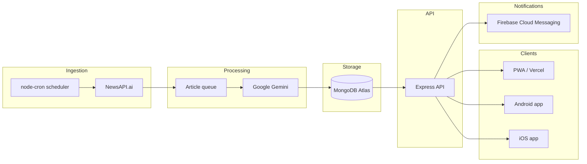

# Sumnews

> **Archived project** — Sumnews is no longer maintained or deployed. This repository is public as a portfolio piece so recruiters and collaborators can review the work behind the product.

**Sumnews** was a cross-platform news app that aggregated articles from many publishers, summarized them with AI, and delivered a personalized feed on web, Android, and iOS. The product shipped as [sumnews.net](https://app.sumnews.net) with native apps on the Play Store and App Store.

---

## What it did

Sumnews helped people stay informed without reading full articles. Raw news was ingested on a schedule, processed through an AI pipeline, stored in MongoDB, and served through a Vue client with swipe-based reading, filters, search, and daily recap digests.

### Key features

- **AI summarization** — Articles were batched and summarized with Google Gemini, with automatic genre tagging
- **Personalized feed** — A scoring algorithm ranked articles by user preferences (genres, sources), engagement signals, recency, and exploration
- **Daily Recaps** — End-of-day digests per news source, with generated cover images and push notifications
- **Cross-platform** — One Vue 3 codebase deployed as a PWA (Vercel), plus native Android and iOS builds via Capacitor
- **Google Sign-In** — OAuth login with JWT sessions; signed-in users got bookmarks, personalized feeds, and notifications
- **Push notifications** — Firebase Cloud Messaging for daily recap alerts
- **Search & filters** — MongoDB Atlas Search and genre/source filtering
- **Swipe interactions** — Mobile-first article cards with swipe actions for sharing and bookmarks
- **Social automation** — Daily recap stories posted to Instagram via the Graph API

---

## Screenshots

<table>
  <tr>
    <td>
      
    </td>
    <td>
      
    </td>
    <td>
      
    </td>
    <td>
      
    </td>
    <td>
      
    </td>
    <td>
      
    </td>
    <td>
      
    </td>
  </tr>
</table>

---

## Architecture



### Article pipeline

1. A cron job polls [NewsAPI.ai](https://newsapi.ai) every 20 minutes for recent activity across configured sources
2. New articles are deduplicated and queued
3. Articles are batched (up to 15) and sent to **Gemini 1.5 Flash** for summarization and genre assignment
4. Processed articles and related events are persisted to MongoDB
5. A separate daily job builds **Daily Recaps** per source, generates images (Stencil API), and triggers push notifications

### Personalized feed

The feed ranking logic lives in `server/2-utils/personalizedFeed.js`. It scores each article using:

- Genre and source affinity (log-scaled from user click history)
- Community engagement (shares, original-article reads vs. clicks)
- Exploration noise to surface diverse content
- Recency via sort order and infinite scroll

---

## Tech stack

| Layer | Technologies |
|-------|--------------|
| **Frontend** | Vue 3, Vite, Vue Router, Tailwind CSS, DaisyUI |
| **Mobile** | Capacitor 7 (Android & iOS), PWA (`vite-plugin-pwa`) |
| **Backend** | Node.js, Express, Helmet, express-rate-limit |
| **Database** | MongoDB Atlas, Mongoose |
| **AI** | Google Generative AI (Gemini 1.5 Flash) |
| **Auth** | Google OAuth, JWT |
| **Notifications** | Firebase Admin + FCM |
| **News data** | NewsAPI.ai (Event Registry) |
| **Deployment** | Heroku (API), Vercel (web client) |

---

## Project structure

```
.
├── server.js                 # Express entry point, cron jobs
├── server/
│   ├── 1-routes/             # HTTP route definitions
│   ├── 2-utils/              # Article queue, AI, feed algorithm, DB helpers
│   ├── 3-middleware/         # JWT authentication
│   ├── 4-models/             # Mongoose schemas
│   ├── 5-logic/              # Business logic notes
│   ├── 6-controllers/        # Request handlers
│   └── config/               # DB and env config (not committed)
└── client/
    ├── src/
    │   ├── components/       # Article UI, Daily Recap, Account, etc.
    │   ├── views/            # Home, Login, Desktop/Mobile layouts
    │   └── scripts/          # API helpers, auth, utilities
    ├── android/              # Capacitor Android project
    └── ios/                  # Capacitor iOS project
```

---

## Running locally (reference only)

This project **will not run out of the box** without credentials and a MongoDB instance. It is documented here for completeness.

### Prerequisites

- Node.js 18+
- MongoDB Atlas cluster (or local MongoDB)
- API keys for the services listed below

### Environment variables

Create `server/config/config.env` (gitignored) with at least:

```env
PORT=3000
MONGODB_URI_PROD=mongodb+srv://...
MONGODB_DATABASE=your_db_name
JWT_SECRET=...
GEMINI_KEY=...
NEWSAPIAI_KEY=...
# Optional: notifications, Instagram, image generation
# FIREBASE_* , INSTAGRAM_ACCOUNT_ID, LONG_LIVED_ACCESS_TOKEN, STENCIL_API_KEY
```

### Install & start

```bash
# Root — API server
npm install
npm start

# Client — in a second terminal
cd client
npm install
npm run prod
```

For mobile builds, use the standard Capacitor workflow from `client/`:

```bash
npm run build
npx cap sync
npx cap open android   # or ios
```

Point `client/src/constants.js` at your local API URL when developing (`dev` config vs `prod`).

---

## What I built

This was a solo full-stack product: ingestion pipeline, AI integration, personalized ranking, REST API, responsive web app, native mobile wrappers, push notifications, and operational cron jobs. The codebase reflects real production concerns — rate limiting, auth middleware, deduplication queues, caching, and cross-origin setup for web and Capacitor schemes.

---

## Status & limitations

- **Deprecated** — Services are shut down; API keys and infrastructure are not included
- **Secrets** — Never commit `.env` files or rotate any keys that may appear in old config
- **Third-party deps** — NewsAPI.ai, Gemini, Firebase, and others require active accounts to reproduce behavior

---

## Links

- **Web app (historical):** [app.sumnews.net](https://app.sumnews.net)
- **Instagram:** [@sumnews_net](https://www.instagram.com/sumnews_net)
- **X:** [@sumnewsdotnet](https://x.com/sumnewsdotnet)
- **LinkedIn:** [Sumnews.net](https://www.linkedin.com/company/sumnews-net)
- **Repository:** [github.com/eluif4/sumnews.net-app](https://github.com/eluif4/sumnews.net-app)

---

## License

This project is provided as-is for portfolio and review purposes. All rights reserved unless otherwise specified by the author.
